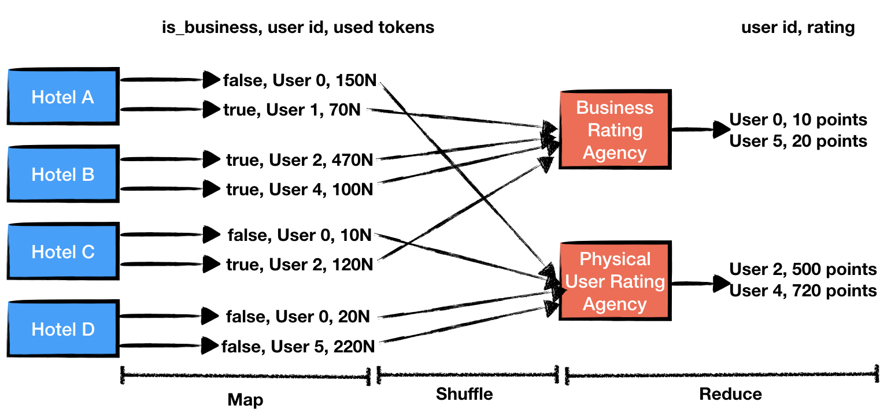

<p align="center">

</p>

## MapReduce with Asynchronous Smart Contracts
*SFBW19 Near Protocol Workshop*

### Pre-requisites

* This workshop assumes you have a Rust development environment. If you don't then please do the following:
    * Install rustup:
        ```bash
        curl --proto '=https' --tlsv1.2 -sSf https://sh.rustup.rs | sh
        ```
    * Add Wasm toolchain:
        ```bash
        rustup target add wasm32-unknown-unknown
        ```
    * Install a Rust IDE. We recommend using CLion with Rust plugin: https://www.jetbrains.com/clion/

* It is advisable to have docker installed too: http://docker.io
* Clone this github repo: https://github.com/nearprotocol/nearcore
* Install [near-shell](https://github.com/nearprotocol/near-shell):
    ```bash
    npm install -g near-shell
    ```
    
### Resources
Throughout this workshop you might find the following resource helpful:
* [near-bindgen](https://github.com/nearprotocol/near-bindgen/) Rust API repository with some minimal documentation;
* [examples from near-bindgen](https://github.com/nearprotocol/near-bindgen/tree/master/examples) contains various
smart contract examples;
* [cross-contract example](https://github.com/nearprotocol/near-bindgen/tree/master/examples/cross-contract-high-level) is
an example of using high-level cross-contract API, including executing distributed merge sort;

Additionally, though not needed, you might find the following resources helpful for the overall understanding of Near Protocol:
* [Runtime high-level documentation](https://docs.google.com/document/d/1VRef627Y-Md1qAdRn0RFUojPxOs5nQmHyHBFYewwbZQ/edit);
* [Nearnomicon](https://nearprotocol.github.io/nomicon/).

## Exercise 0: Start a node and issue a transaction

### If you chose to install docker
To start your local node, go to `nearcore` and run the following script:
```bash
./scripts/start_localnet.py
```
This will pull the docker image and start a single local node. Enter an `<account id>` that you want to be associated with.

Then execute the following to follow the block production logs:
```bash
docker logs --follow nearcore
```

Create a new project:
```bash
near new_project myproject
cd myproject
```

Then in `src/config.json` modify `nodeUrl` to point to your local node:
```js
case 'development':
    return {
        networkId: 'default',
        nodeUrl: 'http://localhost:3030',
        contractName: CONTRACT_NAME,
        walletUrl: 'https://wallet.nearprotocol.com',
    };
```

Then copy the key that the node generated upon starting in your local project to use for transaction signing.
```bash
cp ~/.near/validator_key.json ./neardev/default/<account id>.json
```

### If you chose to not install docker
Go to `nearcore` and run:
```bash
cargo run --package keypair-generator --bin keypair-generator -- --account-id=<account id> --generate-config signer-keys --num-keys=1
```
where `<account id>` is your chosen account id you want to be associated with.

Open `~/.near/signer0_key.json` and give values of `account_id` and `public_key` to Max so that he can create an account for you.

Create a new project:
```bash
near new_project myproject
cd myproject
```

Then in `src/config.json` modify `nodeUrl` to point to your local node:
```js
case 'development':
    return {
        networkId: 'default',
        nodeUrl: 'http://35.230.56.29:3030',
        contractName: CONTRACT_NAME,
        walletUrl: 'https://wallet.nearprotocol.com',
    };
```

Then copy the key that the node generated upon starting in your local project to use for transaction signing.
```bash
cp ~/.near/signer0_key.json ./neardev/default/<account id>.json
```

### Issuing a transaction
First, let's check whether your account exists:
```bash
near state <account id>
```
It should print your account info, including the amount of tokens.

Now, let's create another account user our account:
```bash
near create_account friend_of_<account id> --masterAccount <account id> --initialBalance 100000000000000000
```
and check that it was successfully created:
```bash
near state friend_of_<account id>
```
You should see the tokens that you have transferred during the creation.

Let's send a couple of more tokens to that account:
```bash
near send <account id> friend_of_<account id> 10
```

Success! You have completed the first exercise!

## Exercise 1: Chat (Your first smart contract)

Let's write a smart contract that multiple users will use to leave messages for each other. This contract has the following
requirements:
* We want Alice to be able to call the `leave_message` method on this contract and leave `Hey!` message for Bob;
* We want Bob to be able to call `get_unread_messages` and get a list of messages left for him from everyone;
* We want Bob to be able to call `mark_all_as_read` and mark all unread messages as read.

See [exercises/chat](https://github.com/nearprotocol/workshop/tree/master/exercises/chat) for the project template.

First we create a structure representing the state of our smart contract:
```rust
#[near_bindgen]
#[derive(Default, BorshDeserialize, BorshSerialize)]
pub struct Chat {
    // receiver_id -> list of (sender_id, message).
    unread_messages: HashMap<String, Vec<(String, String)>>,
}
```

Let's walk over the code here:
* `#[near_bindgen]` decorator marks it as a structure representing the contract state;
* `#[derive(Default)]` creates a function that will be automatically used to initialize the contact upon its first execution;
* `#[derive(BorshSerialize, BorshDeserialize)]` allows the state of the contract to be serialized with our binary serializer [borsh](http://borsh.io/);
* The structure itself contains a single field that maps message receiver to a list of messages together with whoever sent them.

Then we create smart contract methods:
```rust
#[near_bindgen]
impl Chat {
    pub fn leave_message(&mut self, receiver_id: String, message: String) {
        let sender_id = env::signer_account_id();
        // Add message to records.
    }
    
    ...
}
```

Let's walk over the code:
* `#[near_bindgen]` decorator marks public methods in the `impl` section as smart contract methods;
* Each method is a regular method, with one nuance, if it uses `&mut self` this method is expected to mutate the state of the contract
and can only be called using a transaction. If it uses `&self` then it can also be called as a "view" method without transactions;
* Internally each method is able to retrieve the account id of whoever called it, using `env::signer_account_id()`. See the full list of `env::*` methods [here](https://github.com/nearprotocol/near-bindgen/blob/master/near-bindgen/src/environment/env.rs).

Now go ahead and implement the rest of the code! You can check your solution by running `cargo test` from the `chat` folder.
You can also find the solution in [exercises/chat-solution](https://github.com/nearprotocol/workshop/tree/master/exercises/chat-solution)

You can build your smart contract with
```bash
cargo build --target wasm32-unknown-unknown --release
```

### Deploying and running the contract
First, let's create several accounts for the playground. Go to `myproject` and run:
```bash
near create_account chat_<account id> --masterAccount <account id> --initialBalance 10000000000000000
near create_account alice_<account id> --masterAccount <account id> --initialBalance 10000000000000000
near create_account bob_<account id> --masterAccount <account id> --initialBalance 10000000000000000
near create_account carol_<account id> --masterAccount <account id> --initialBalance 10000000000000000
```

Let's deploy your smart contract to `chat_<account id>`:
```bash
near deploy --accountId=chat_<account id> --wasmFile=../Projects/workshop/exercises/chat-solution/target/wasm32-unknown-unknown/release/chat_solution.wasm
```
(You would have to modify the Wasm path)

Now, let's use Alice's account to leave a message for Bob:
```bash
near call chat_<account id> leave_message '{"receiver_id": "bob_<account id>", "message": "Hey!"}' --accountId=alice_<account id>
```
And use Carol's account to leave a message for Bob:
```bash
near call chat_<account id> leave_message '{"receiver_id": "bob_<account id>", "message": "Hi!"}' --accountId=carol_<account id>
```
Finally, let's use Bob's account to lookup unread messages:
```bash
near call chat_<account id> get_unread_messages '' --accountId=bob_<account id>
```
You should observe:
```
[ [ 'alice_hellomax', 'Hey!' ], [ 'carol_hellomax', 'Hi!' ] ]
```

Congratulations, you wrote your first smart contract!

## Exercise 2: Inbox (Your first cross-contract call)

The previous smart contract might leave some users uncomfortable. After all, in the blockchain world we want to own our
own data :) Let's have a decentralized version of the previous smart contract, called "Inbox" where we have one smart
contract per user and when Alice want to leave a message for Bob she calls a method on Bob's account. Specifically:
* We want Alice to be able to call the `send` method on her own account to send Bob a message. `send` in turn should
call `leave_message` on Bob's account;
* We also want Alice to be able to call `get_all_unread_messages` and `mark_all_as_read` on any account similarly the
previous smart contract.

See [exercises/inbox](https://github.com/nearprotocol/workshop/tree/master/exercises/inbox) for the project template.

First, just in the previous exercise we want to create a structure for the state of the smart contract:
```rust
#[near_bindgen]
#[derive(Default, BorshDeserialize, BorshSerialize)]
pub struct Inbox {
    // sender_id -> left messages.
    unread_messages: HashMap<String, Vec<String>>,
}
```
Unlike, in the previous exercise,`unread_messages` only stores the messages addressed to the current account.

Then we want to write the smart contract methods:
```rust
#[near_bindgen]
impl Inbox {
    pub fn send(&self, receiver_id: String, message: String) {
        unimplemented!()
    }

    pub fn get_all_unread_messages(&self) -> HashMap<String, Vec<String>> {
        unimplemented!()
    }

    pub fn mark_all_as_read(&mut self) {
        unimplemented!()
    }
}
```

`send` method however, is going to call a method on another contract in an asynchronous way. To benefit from Rust's
strong typing we can declare a trait representing the external methods that we want to call:
```rust
#[ext_contract]
pub trait ExtInbox {
    fn leave_message(&mut self, message: String);
}
```

Let's walk over the code here:
* `#[ext_contract]` decorator marks the trait as an interface of an external contract;
* `ExtInbox` is some trait declaring methods of the smart contract that we want to call. In our special case we calling
the same smart contract that lives on a different account.

Since we are calling the same contract that lives on a different account we can make it even more explicit, by implementing this
trait:
```rust
#[near_bindgen]
impl ExtInbox for Inbox {
    fn leave_message(&mut self, message: String) {
        unimplemented!()
    }
}
```

Since, it is the first time for you implementing a cross-contract, we will implement `send` method for you:
```rust
pub fn send(&self, receiver_id: String, message: String) {
    let prepaid_gas = env::prepaid_gas();
    ext_inbox::leave_message(message, &receiver_id, 0, prepaid_gas/2);
}
```
Now, go ahead and implement the rest of the methods! Unfortunately, we have not implemented unit testing of cross-contract
calls yet, but you can run `cargo test` from the `inbox` folder to test regular methods. We will fully test our code by
deploying it to a local node.
You can also find the solution in [exercises/inbox-solution](https://github.com/nearprotocol/workshop/tree/master/exercises/inbox-solution)

Build your smart contract with
```bash
cargo build --target wasm32-unknown-unknown --release
```

### Deploying and running the contract
Let's wipe out and re-create Alice's and Bob's accounts so that we have clean state for both of them.
Go to `myproject`, wipe them out:
```bash
near delete_account alice_hellomax hellomax
near delete_account bob_hellomax hellomax
```
Here we used `hellomax` as the reciever of the remaining funds on Alice's and Bob's accounts.

Recreate accounts:
```bash
near create_account alice_hellomax --masterAccount hellomax --initialBalance 10000000000000000
near create_account bob_hellomax --masterAccount hellomax --initialBalance 10000000000000000
```
and redeploy a new smart contract on them:
```bash

near deploy --accountId=alice_hellomax --wasmFile=../Projects/workshop/exercises/inbox-solution/target/wasm32-unknown-unknown/release/inbox_solution.wasm
near deploy --accountId=bob_hellomax --wasmFile=../Projects/workshop/exercises/inbox-solution/target/wasm32-unknown-unknown/release/inbox_solution.wasm
```
Now Alice will use her own smart contract to leave a message for Bob:
```bash
near call alice_hellomax send '{"receiver_id": "bob_hellomax", "message": "Hi!"}' --accountId=alice_hellomax
```

Finally, let's use Bob's account to retrieve unread messages:
```bash
near call bob_hellomax get_all_unread_messages '' --accountId=bob_hellomax
```
You should observe:
```
{ alice_hellomax: [ 'Hi!' ] }
```

Congratulations, you wrote your first smart contract that asynchronously calls another smart contract.

## Exercise 3: Messenger (Your first callback)

In the previous example when Alice sends a message she has no way of knowing what messages Bob has already read.
Can we modify the `Inbox::send` method that not only it sends the message to Bob but also retrieves Alice's messages that Bob has not read yet?

We will do three modifications to our inbox contract. First we all add `get_unread_messages` method for retrieve
unread messages send by a specific sender:

```rust
#[ext_contract]
pub trait ExtMessenger {
    fn leave_message(&mut self, message: String);
    fn get_unread_messages(&self, sender_id: String) -> Vec<String>;
}
```

Then we will specify that  `get_unread_messages` should be executed right after `leave_message`:
```rust
pub fn send(&self, receiver_id: String, message: String) {
        let prepaid_gas = env::prepaid_gas();
        let this_account = env::current_account_id();
        ext_messenger::leave_message(message, &receiver_id, 0, prepaid_gas/3)
            .then(ext_messenger::get_unread_messages(this_account, &receiver_id, 0, prepaid_gas/3));
    }
```

However, we have not told Rust yet that we want `send` to return the result of executing `get_unread_messages` on another
contract. We can do it by simply returning the promise:
```rust
pub fn send(&self, receiver_id: String, message: String) -> Promise {
        let prepaid_gas = env::prepaid_gas();
        let this_account = env::current_account_id();
        ext_messenger::leave_message(message, &receiver_id, 0, prepaid_gas/3)
            .then(ext_messenger::get_unread_messages(this_account, &receiver_id, 0, prepaid_gas/3))
    }
```

Now go ahead and finish implementation of other methods containing `unimplemented!()`.
You can also find the solution in [exercises/messenger-solution](https://github.com/nearprotocol/workshop/tree/master/exercises/messenger-solution).

Build your smart contract with
```bash
cargo build --target wasm32-unknown-unknown --release
```

### Deploying and running the contract
Again, we wipe out Alice's and Bob's accounts and redeploy new accounts on them.
Go to `myproject` and run:
```bash
near delete_account alice_hellomax hellomax
near delete_account bob_hellomax hellomax
near create_account alice_hellomax --masterAccount hellomax --initialBalance 10000000000000000
near create_account bob_hellomax --masterAccount hellomax --initialBalance 10000000000000000
near deploy --accountId=alice_hellomax --wasmFile=../Projects/workshop/exercises/messenger-solution/target/wasm32-unknown-unknown/release/messenger_solution.wasm
near deploy --accountId=bob_hellomax --wasmFile=../Projects/workshop/exercises/messenger-solution/target/wasm32-unknown-unknown/release/messenger_solution.wasm
```

Now Alice will use her own smart contract to leave a message for Bob:
```bash
near call alice_hellomax send '{"receiver_id": "bob_hellomax", "message": "Hi!"}' --accountId=alice_hellomax
```
Observe:
```
[ 'Hi!' ]
```

Bob, obviously has not seen our message yet, because we just sent it a moment ago. However, technically Bob could've
concurrently issued method call to `mark_all_as_read` which would have resulted in us observing `[]` instead.

Let's leave another message for Bob:
```bash
near call alice_hellomax send '{"receiver_id": "bob_hellomax", "message": "Wanna hang?"}' --accountId=alice_hellomax
```
And just like in real life, observe that both `Hi!` and `Wanna Hang?` were not even read yet:
```
[ 'Hi!', 'Wanna hang?' ]
```

Now let's use Bob's account to mark these messages as read (without replying, naturally):
```bash
near call bob_hellomax mark_all_as_read '' --accountId=bob_hellomax
```

And let's leave another message from Alice's account:
```bash
near call alice_hellomax send '{"receiver_id": "bob_hellomax", "message": "AFK?"}' --accountId=alice_hellomax
```
Observe that now only `AFK?` message is marked as unread:
```
[ 'AFK?' ]
```

## Challenge: Rating aggregator using MapReduce

In MapReduce there are typically two sets of workers: Map (sometimes Map+Shuffle) and Reduce that process some large
amount of data in distributed manner.
Each Map worker reads some local data and *maps* it to some output data.
The output data is usually indexed by some key and each key is associated with a single Reduce worker. Though a single
reduce worker can be associated with multiple keys. Each Reduce worker then performs an aggregation step on the received
data.

We will do the following:
* Write a `hotel` that has initialization function `init` that creates fake user data;
* Write a `hotel_factory` contract that deploys several `hotel` contracts and initializes them.

The challenge is to write `agency` contract that has `user_ratings` method that kicks off map-shuffle-reduce by asking
`hotel` contracts to aggregate their user data and send the relevant key to the agency contract.

<p align="center">

</p>

### Hotel contract

We wrote a hotel contract for you, you can find it in [exercises/mapreduce/hotel](https://github.com/nearprotocol/workshop/tree/master/exercises/mapreduce/hotel).

Let's walk through the code. We have defined three structures: `Hotel`, `Reservation`, and `User`.
Each of them derives `BorshSerialize` and `BorshDeserialize` so that they can be saved in the state. `Reservation`
and `User` also derive `serde::{Serialize, Deserialize}` so that we can return them in JSON format.

```rust
#[derive(BorshDeserialize, BorshSerialize, Serialize, Deserialize, Clone)]
pub struct User {
    is_business: bool,
    id: String,
}

#[derive(BorshDeserialize, BorshSerialize, Serialize, Deserialize, Clone)]
pub struct Reservation {
    user: User,
    amount: u64,
    date: String,
    room_number: u64
}

#[near_bindgen]
#[derive(Default, BorshDeserialize, BorshSerialize)]
pub struct Hotel {
    past_reservations: Vec<Reservation>,
}
```

In addition to a simple `get_reservation` function we have implemented a new type of function `new_random`. `new_random`
can be used to (re)set the state of the smart contract; in other words, initialize it. We declare that this function
can be used for initialization with `#[near_bindgen(init => new_random)]` decorator.

### Hotel factory contract

We wrote a contract that deploys a bunch of hotels for you, you can find it in [exercises/mapreduce/hotel-factory](https://github.com/nearprotocol/workshop/tree/master/exercises/mapreduce/hotel-factory).

Let's walk through the code. `HotelFactory` does not have its own state, therefore the structure has no fields:
```rust
#[near_bindgen]
#[derive(Default, BorshDeserialize, BorshSerialize)]
pub struct HotelFactory {}
```

`HotelFactory` has only one method: `deploy_hotels` which takes two arguments: the number of hotel contracts to deploy
and how many fake stays should we generate per hotel contract. For each hotel contract this function does the following:
* `Promise::new(account_id.clone()).create_account()` -- creates an account with that name;
* `transfer(tokens_per_hotel)` -- transfers some amount of tokens to it;
* `add_full_access_key(env::signer_account_pk())` -- adds an "access key" so that we can sign transaction for this account using the same public key we've been using;
* `deploy_contract(include_bytes!("../../hotel/target/wasm32-unknown-unknown/release/hotel.wasm").to_vec())` -- deploys the `hotel` smart contract to that account;
* When all of the above stuff is finished (it is going to be executed together) it performs a function call to `new_random`
to initialize the contract.

Overall the code looks like this:
```rust
#[near_bindgen]
impl HotelFactory {
    /// Asynchronously deploy several hotels.
    pub fn deploy_hotels(&self, num_hotels: u8, stays_per_hotel: u64) {
        let tokens_per_hotel = env::account_balance()/(num_hotels as u128 + 1); // Leave some for this account.
        let gas_per_hotel = env::prepaid_gas()/(num_hotels as u64 + 1); // Leave some for this execution.
        for i in 0..num_hotels {
            let account_id = format!("hotel{}", i);
            Promise::new(account_id.clone())
                .create_account()
                .transfer(tokens_per_hotel)
                .add_full_access_key(env::signer_account_pk())
                .deploy_contract(
                    include_bytes!("../../hotel/target/wasm32-unknown-unknown/release/hotel.wasm").to_vec(),
                ).then(ext_hotel::new_random(i, stays_per_hotel, &account_id, 0, gas_per_hotel));
        }
    }
}
```

### Building and running the contacts
Let's build the hotel factory and deploy several hotel contracts.
Go to `myproject` and run:
```bash
near create_account factory_hellomax --masterAccount hellomax --initialBalance 10000000000000000
```

Then deploy the factory smart contract to it:
```bash
near deploy --accountId=factory_hellomax --wasmFile=../Projects/workshop/exercises/mapreduce/hotel-factory/target/wasm32-unknown-unknown/release/hotel_fac
tory.wasm
```

Now, let's deploy three hotels with 10 reservations in each:
```bash
near call factory_hellomax deploy_hotels '{"num_hotels": 3, "stays_per_hotel": 10}' --accountId=factory_hellomax
```
Finally, let's verify that the hotels were deployed and contain fake user data:
```bash
near call hotel0 get_reservations '' --accountId=factory_hellomax
```
You should observe:
```
[
 {
    user: { is_business: false, id: 'User61' },
    amount: 87,
    date: '2019-10-25',
    room_number: 122
  },
  {
    user: { is_business: true, id: 'User38' },
    amount: 50,
    date: '2019-10-24',
    room_number: 189
  }
  ....
]
```
(Truncated)

### Implementing the agency contract

Now go ahead and implement the agency contract! Please ask Max for any questions, also refer to the documentation
at the beginning of this document.
